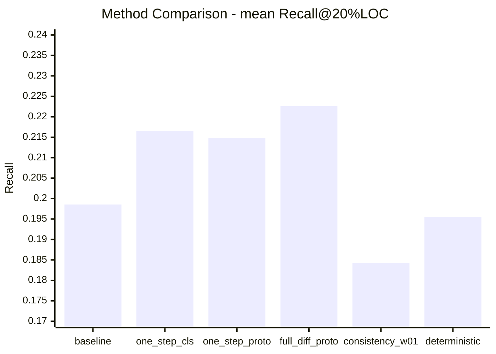
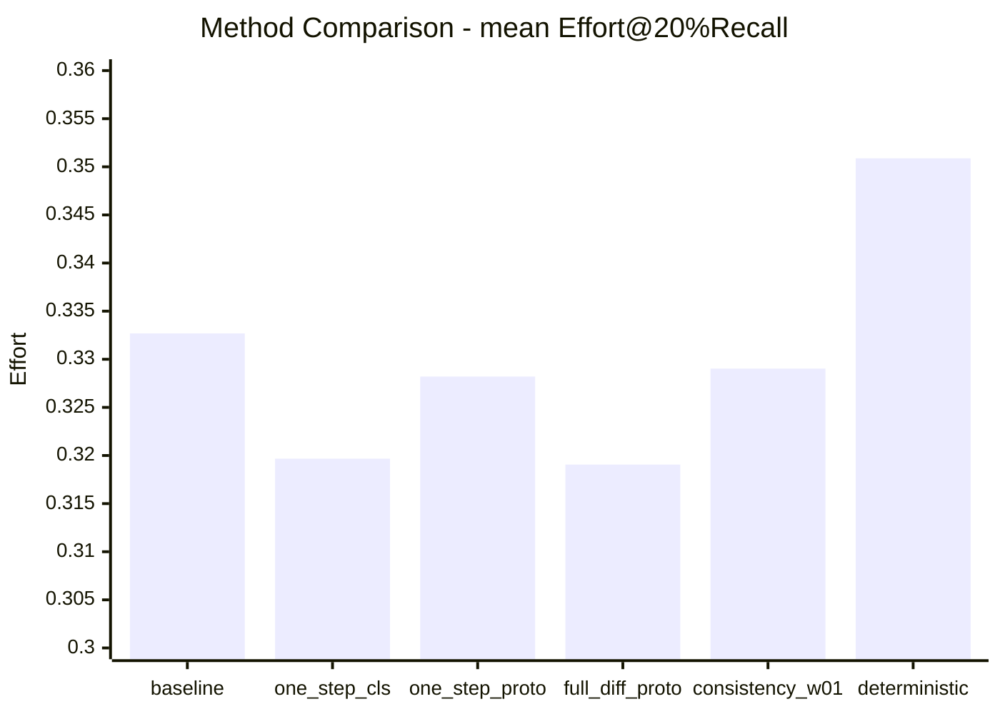
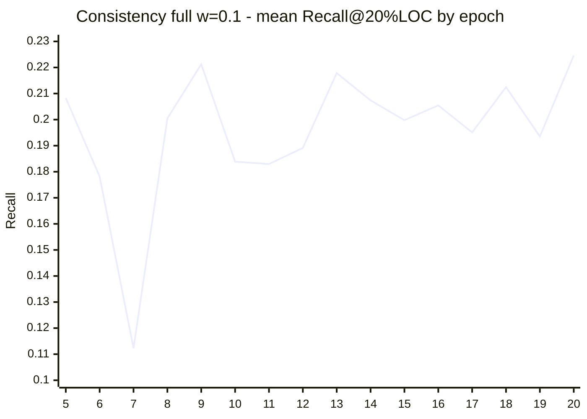

# CodeDiff activemq 实验汇报精简版

## 1. 结论
- 当前综合最优方法是 full_diffusion_prototype：在均值层面同时实现更高 Recall@20%LOC 与更低 Effort@20%Recall。
- deterministic full diffusion 明显退化，说明去除采样随机性不是主要解法。
- consistency loss 在工程上可行，但当前配置下仅带来轻微 Effort 改善，未带来 Recall 提升。
- 不同 release 的最优方法并不一致，跨版本稳健性仍是后续重点。

---

## 2. 实验阶段概览

| 阶段 | 代表实验 | 目标 | 结果摘要 |
|---|---|---|---|
| 基线与主干收敛 | activemq_sw、baseline_within_release | 建立训练与评测基线 | 提供稳定对照与收敛观察 |
| 推理范式对比 | one_step_classifier、one_step_prototype、full_diffusion_prototype | 比较 one-step/full diffusion 与分类头/原型策略 | full_diffusion_prototype 综合最优 |
| 随机性诊断 | full_diffusion_prototype_deterministic | 检查随机 reverse 是否主因 | 确定性版本更差，否定该假设 |
| 一致性约束 A/B | consistency_ablation_w0、consistency_ablation_w01 | 验证 consistency loss 是否有正向信号 | 短程有弱正向信号 |
| 一致性全量训练 | consistency_full_w01_resume | 评估完整训练后最终收益 | Effort 略降，Recall 下降，未超最优 |

---

## 3. 方法级核心指标（汇报主表）

| 方法 | mean Recall@20%LOC | mean Effort@20%Recall | 相对 baseline Recall | 相对 baseline Effort |
|---|---:|---:|---:|---:|
| baseline_within_release | 0.198555 | 0.332688 | 0.00% | 0.00% |
| one_step_classifier | 0.216548 | 0.319666 | +9.06% | -3.91% |
| one_step_prototype | 0.214885 | 0.328199 | +8.22% | -1.35% |
| full_diffusion_prototype | 0.222634 | 0.319059 | +12.13% | -4.10% |
| consistency_full_w01_resume | 0.184245 | 0.329031 | -7.21% | -1.10% |
| full_diffusion_prototype_deterministic | 0.195503 | 0.350885 | -1.54% | +5.47% |

### 图1：Recall@20%LOC 对比（越高越好）

### 图2：Effort@20%Recall 对比（越低越好）

---

## 4. 分 release 结果（汇报补充页）

| release | Recall 最优方法 | Recall 值 | Effort 最优方法 | Effort 值 |
|---|---|---:|---|---:|
| activemq-5.1.0 | full_diffusion_prototype | 0.230107 | full_diffusion_prototype | 0.274353 |
| activemq-5.2.0 | full_diffusion_prototype | 0.280078 | full_diffusion_prototype | 0.313513 |
| activemq-5.3.0 | one_step_classifier | 0.239934 | one_step_classifier | 0.321353 |
| activemq-5.8.0 | baseline_within_release | 0.233635 | baseline_within_release | 0.283493 |

解读：
- full diffusion 在多数 release 上占优，但并非全胜。
- one-step classifier 在特定 release 上有竞争力。
- baseline 在个别 release 反超，说明泛化稳定性仍有提升空间。

---

## 5. consistency 全量实验：epoch 走势（仅保留核心图）

| epoch | mean Recall@20%LOC | mean Effort@20%Recall |
|---:|---:|---:|
| 5 | 0.208303 | 0.339045 |
| 6 | 0.178133 | 0.344714 |
| 7 | 0.112284 | 0.284650 |
| 8 | 0.200454 | 0.347770 |
| 9 | 0.221252 | 0.324280 |
| 10 | 0.183868 | 0.344918 |
| 11 | 0.182957 | 0.344685 |
| 12 | 0.189142 | 0.356071 |
| 13 | 0.217837 | 0.334713 |
| 14 | 0.207387 | 0.335351 |
| 15 | 0.199775 | 0.339959 |
| 16 | 0.205461 | 0.327732 |
| 17 | 0.195094 | 0.342085 |
| 18 | 0.212465 | 0.319093 |
| 19 | 0.193539 | 0.334532 |
| 20 | 0.224597 | 0.334400 |

---

## 6. 汇报建议话术（可直接念）
- 我们已完成从基线、推理范式到一致性约束的系统性实验。
- 目前最优方案是 full_diffusion_prototype，且优势主要体现在 Recall 提升并伴随 Effort 降低。
- 一致性约束方向正确但收益有限，下一步将与类别不平衡策略联合优化，目标是提升跨 release 稳健性。

---

## 7. 附件与原始结果
- 详细版报告：[CodeDiff/eval_result/experiments_timeline_report_20260324.md](experiments_timeline_report_20260324.md)
- 历史总报告：[CodeDiff/eval_result/all_ideas_experiments_report_20260324.md](all_ideas_experiments_report_20260324.md)
- 汇总表：[CodeDiff/eval_result/recall_effort20_method_compare_summary.csv](recall_effort20_method_compare_summary.csv)
- 逐 release 表：[CodeDiff/eval_result/recall_effort20_method_compare.csv](recall_effort20_method_compare.csv)
