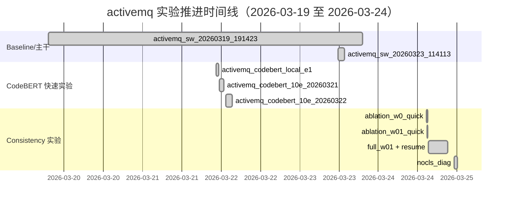
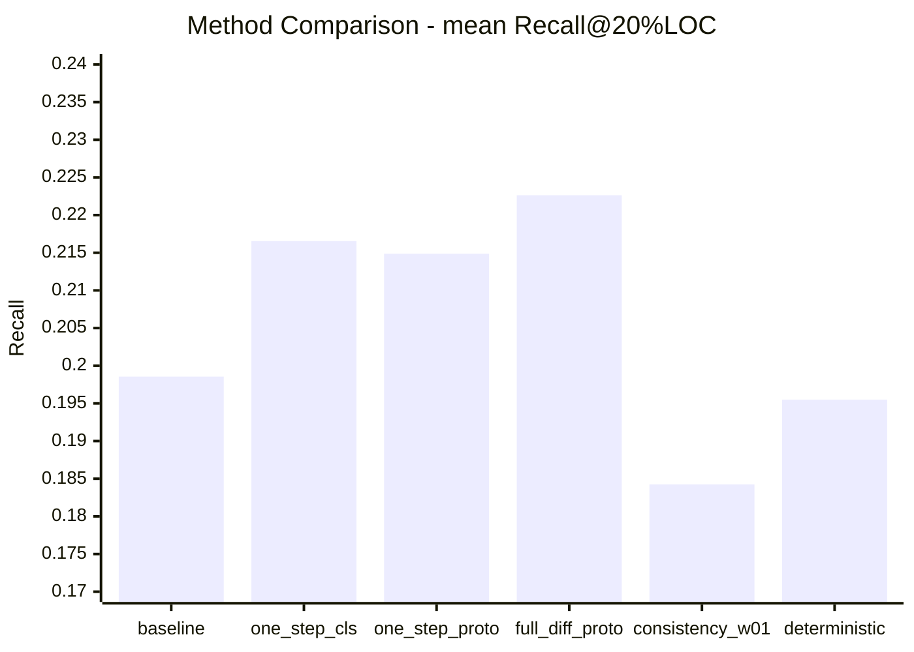
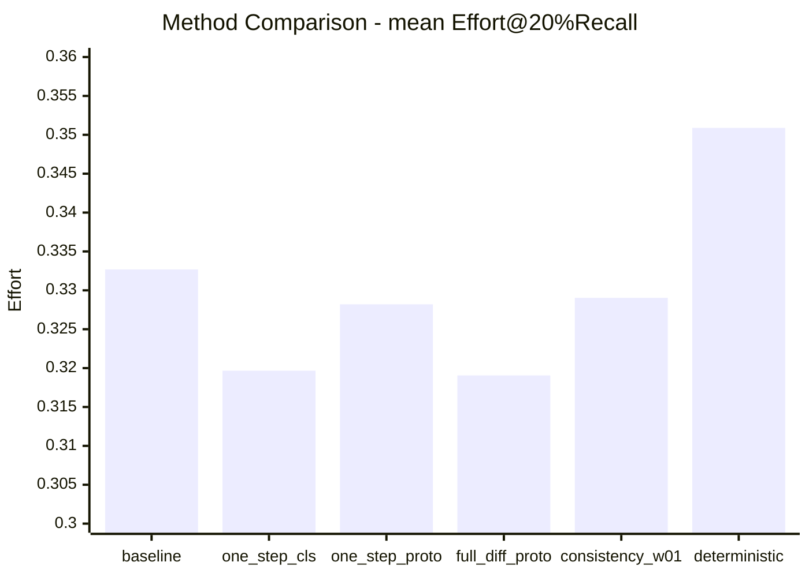
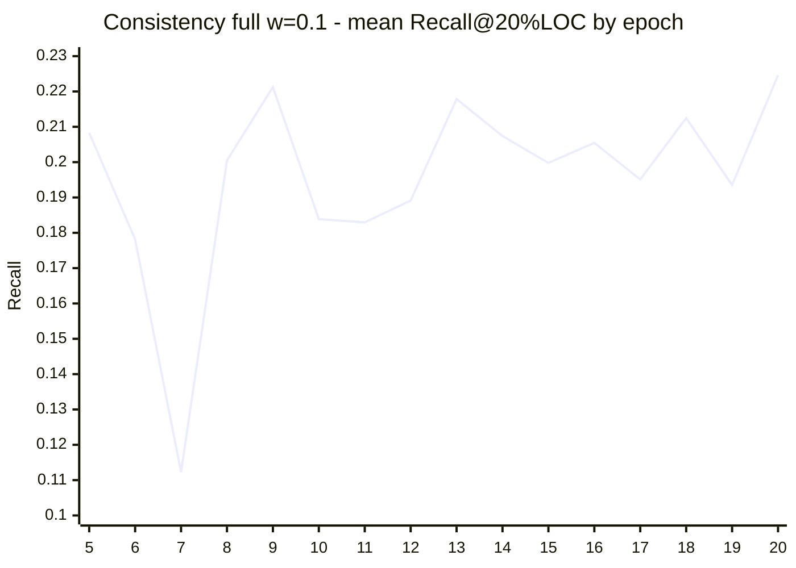

# CodeDiff activemq 历史实验时间线与结果分析报告（2026-03-24）

## 1. 报告目标
基于当前仓库中的历史训练产物、评估汇总与诊断文件，按时间顺序整理已完成实验，并给出量化对比分析。

数据来源（核心）：
- [codediff/output/model/CodeDiff/activemq](../../codediff/output/model/CodeDiff/activemq)
- [codediff/output/loss/CodeDiff](../../codediff/output/loss/CodeDiff)
- [CodeDiff/eval_result/recall_effort20_method_compare_summary.csv](recall_effort20_method_compare_summary.csv)
- [CodeDiff/eval_result/recall_effort20_method_compare.csv](recall_effort20_method_compare.csv)
- [CodeDiff/eval_result/activemq_consistency_full_w01_resume_20260324_all_epochs_eval/recall_effort20_mean_by_epoch.csv](activemq_consistency_full_w01_resume_20260324_all_epochs_eval/recall_effort20_mean_by_epoch.csv)

---

## 2. 实验时间线（按时间顺序）

| 时间 | 实验名 | 训练轮数 | checkpoint 数 | 主要用途 | 关键结论 |
|---|---|---:|---:|---|---|
| 2026-03-19 19:14:23 | activemq_sw_20260319_191423 | 20 | 13 | 早期主干训练与续跑 | 建立了后续诊断与收敛分析基础 |
| 2026-03-21 22:33:04 | activemq_codebert_local_e1 | 1 | 0 | 本地快速 smoke | 可跑通，但规模太小 |
| 2026-03-21 23:21:51 | activemq_codebert_10e_20260321_232151 | 10 | 0 | 10 epoch 快速训练 | 提供早期对照点 |
| 2026-03-22 01:23:14 | activemq_codebert_10e_20260322_012314 | 10 | 2 | 10 epoch 继续实验 | 形成更稳定对照 |
| 2026-03-23 11:41:13 | activemq_sw_20260323_114113 | 100 | 0 | 长程收敛监控与诊断基座 | valid_f1 长期在 0.0075~0.0079，出现高 recall/低 precision 倾向 |
| 2026-03-24 14:45:24 | activemq_consistency_ablation_w0_quick_20260324 | 2 | 0 | consistency 权重 w=0 快速对照 | 作为 A/B 基线 |
| 2026-03-24 14:48:05 | activemq_consistency_ablation_w01_quick_20260324 | 2 | 0 | consistency 权重 w=0.1 快速对照 | best valid_f1 略优于 w=0 |
| 2026-03-24 15:11:48 | activemq_consistency_full_w01_20260324 | 20 | 0 | consistency 全量训练（首段） | 后续以 resume 实验承接 |
| 2026-03-24 15:18:34 | activemq_consistency_full_w01_resume_20260324 | 20 | 20 | consistency 全量训练（续跑完成） | 最终 Effort 略降，但 Recall 低于 baseline |
| 2026-03-24 23:08:30 | activemq_nocls_cons_diag_20260324 | 5 | 0 | no-cls 诊断实验 | 用于分析分类头贡献 |
| 2026-03-24 23:20:33 | activemq_cons_auto_logcheck_20260324 | 1 | 0 | 自动日志检查实验 | 工程校验用途 |
| 2026-03-24 23:25:14 | activemq_formal_consauto_20260324 | 20 | 0 | formal consistency 版本 | 作为完整流程验证补充 |

### 时间线图（Gantt）

注：时长按日志与目录时间做近似展示，用于表达先后关系与实验簇，不代表精确 wall-clock。

---

## 3. 方法级最终指标对比（Recall@20%LOC / Effort@20%Recall）

| 方法 | mean Recall@20%LOC | mean Effort@20%Recall | 相对 baseline 的 Recall 变化 | 相对 baseline 的 Effort 变化 |
|---|---:|---:|---:|---:|
| baseline_within_release | 0.198555 | 0.332688 | 0.00% | 0.00% |
| one_step_classifier | 0.216548 | 0.319666 | +9.06% | -3.91% |
| one_step_prototype | 0.214885 | 0.328199 | +8.22% | -1.35% |
| full_diffusion_prototype | 0.222634 | 0.319059 | +12.13% | -4.10% |
| consistency_full_w01_resume | 0.184245 | 0.329031 | -7.21% | -1.10% |
| full_diffusion_prototype_deterministic | 0.195503 | 0.350885 | -1.54% | +5.47% |

### 图1：各方法 mean Recall@20%LOC

### 图2：各方法 mean Effort@20%Recall（越低越好）

结论：
- 历史最优仍为 full_diffusion_prototype（Recall 最高，Effort 也更低）。
- deterministic full diffusion 明显劣化，说明“去随机化”没有解决核心问题。
- consistency 全量训练在 Effort 上有小幅改善，但 Recall 下滑，综合收益不足。

---

## 4. 按 release 的胜出方法统计

| release | Recall 最优方法 | Recall 值 | Effort 最优方法 | Effort 值 |
|---|---|---:|---|---:|
| activemq-5.1.0 | full_diffusion_prototype | 0.230107 | full_diffusion_prototype | 0.274353 |
| activemq-5.2.0 | full_diffusion_prototype | 0.280078 | full_diffusion_prototype | 0.313513 |
| activemq-5.3.0 | one_step_classifier | 0.239934 | one_step_classifier | 0.321353 |
| activemq-5.8.0 | baseline_within_release | 0.233635 | baseline_within_release | 0.283493 |

统计解读：
- 4 个 release 中，full_diffusion_prototype 在 2 个版本上双指标最优。
- one_step_classifier 在 activemq-5.3.0 最优，说明不同版本存在数据分布差异。
- baseline 在 activemq-5.8.0 反超，提示模型泛化并非单向稳定提升。

---

## 5. consistency_full_w01_resume 的逐 epoch 行为分析

数据文件：
- [CodeDiff/eval_result/activemq_consistency_full_w01_resume_20260324_all_epochs_eval/recall_effort20_mean_by_epoch.csv](activemq_consistency_full_w01_resume_20260324_all_epochs_eval/recall_effort20_mean_by_epoch.csv)

| epoch | mean Recall@20%LOC | mean Effort@20%Recall |
|---:|---:|---:|
| 5 | 0.208303 | 0.339045 |
| 6 | 0.178133 | 0.344714 |
| 7 | 0.112284 | 0.284650 |
| 8 | 0.200454 | 0.347770 |
| 9 | 0.221252 | 0.324280 |
| 10 | 0.183868 | 0.344918 |
| 11 | 0.182957 | 0.344685 |
| 12 | 0.189142 | 0.356071 |
| 13 | 0.217837 | 0.334713 |
| 14 | 0.207387 | 0.335351 |
| 15 | 0.199775 | 0.339959 |
| 16 | 0.205461 | 0.327732 |
| 17 | 0.195094 | 0.342085 |
| 18 | 0.212465 | 0.319093 |
| 19 | 0.193539 | 0.334532 |
| 20 | 0.224597 | 0.334400 |

### 图3：consistency 全量实验 Recall 曲线

观察：
- 该实验存在明显波动，7 epoch 出现低谷，20 epoch 回升到局部最高点。
- Recall 的后期回升没有同步带来方法级最终优势，说明排序稳定性与泛化仍受限。

---

## 6. 结合历史数据的综合判断

1. 当前最优方案仍是 full_diffusion_prototype。
2. 训练-推理不一致问题依旧存在，典型症状是高 recall 倾向与 precision 失衡并存。
3. consistency loss 提供了工程上可行的约束手段，但单独引入不足以超过已有最优推理方案。
4. release 间表现差异明显，后续应把“跨版本稳健性”设为一等目标，而非仅追求均值最优。

---

## 7. 后续建议（按优先级）

1. 在 consistency 框架上加入类别不平衡控制（如 pos_weight/focal 风格）并联合调参，以抑制假阳性。
2. 对 consistency 项做按 t 分段加权，重点约束中后段反向链，减少对排序能力的过约束。
3. 把验证选择标准从单一 valid_f1 扩展到 effort-aware 指标，提升与最终 Recall/Effort 目标的一致性。

---

## 8. 附：可复用图表与历史报告

- 历史总报告：[CodeDiff/eval_result/all_ideas_experiments_report_20260324.md](all_ideas_experiments_report_20260324.md)
- 方法对比图（已有 PNG）：
  - 
  - 
  - 
