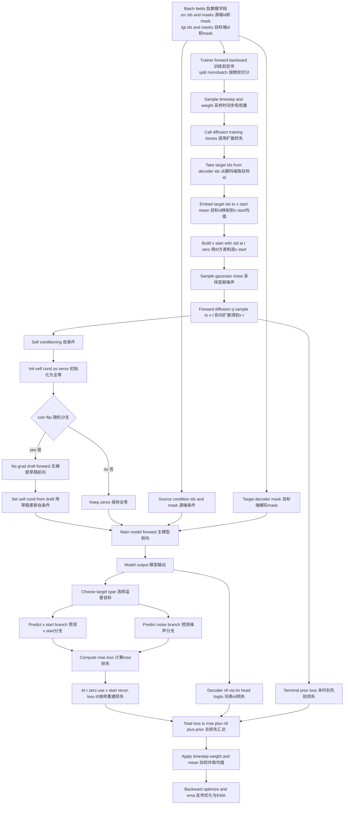

## 中文说明（单步前向）

1. **读取 batch**
    - 从 DataLoader 取到四类字段：`input_ids`、`attention_mask`、`decoder_input_ids`、`decoder_attention_mask`。
    - 在 `Trainer.forward_backward` 中按 `microbatch` 切分后逐段计算。

2. **采样时间步并进入扩散损失**
    - `schedule_sampler` 采样当前时间步 `t` 和权重 `weights`。
    - 调用 `diffusion.training_losses(...)` 进入核心损失计算。

3. **构造扩散输入**
    - 目标端 token（`decoder_input_ids`）先映射到 embedding，得到 `x_start_mean`。
    - 在 `x_start_mean` 上加标准差扰动得到 `x_start`，再通过前向扩散 `q_sample` 得到带噪的 `x_t`。

4. **Self-conditioning**
    - 先把 `self_conditions` 设为全零。
    - 以约 50% 概率先无梯度跑一遍模型拿到草稿输出，再把该输出 `detach` 后作为 `self_conditions` 进行正式前向。

5. **主模型前向（Encoder-Decoder）**
    - 源端条件：`input_ids + attention_mask`。
    - 目标端输入：`x_t`（以及 `decoder_attention_mask`）。
    - 模型输出 `model_output`，用于预测目标扩散量（通常是 `x_start` 或噪声）。

6. **计算损失项并汇总**
    - **MSE 主损失**：`(target - model_output)^2`。
    - **t=0 特例**：用 `x_start` 重建误差替换对应位置。
    - **Decoder NLL**：通过 `lm_head` 的词表 logits 与离散 token 做监督。
    - **tT prior loss**：末时刻先验正则项。
    - 总损失：`loss = mse + decoder_nll + tT_loss`。

7. **回传与更新**
    - 训练侧对总损失乘以时间步权重并求均值。
    - 执行 `backward`、`optimizer.step()` 和 `EMA` 参数更新。